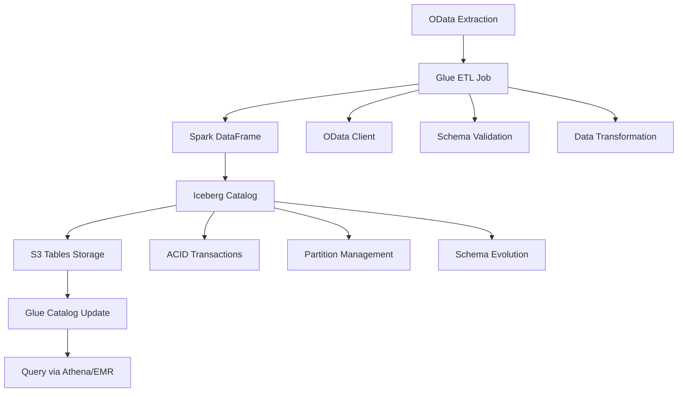
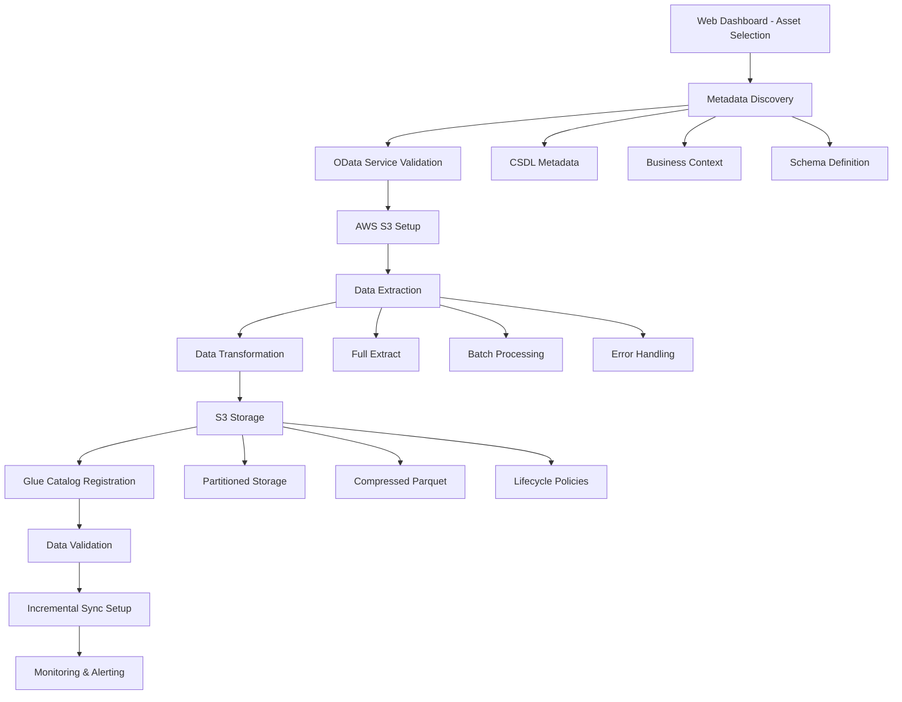

# Design Document

## Overview

The SAP Datasphere to AWS Glue metadata synchronization system implements a three-environment architecture with MCP server integration to provide comprehensive metadata management across development, testing, and production environments. The system focuses on preserving business context while enabling AWS analytics capabilities on Datasphere data assets.

## Architecture

### Three-Environment Architecture

#### 🐕 DOG Environment (Development)
- **Technology**: FastAPI Web Dashboard with real integrations
- **Port**: 8001
- **Purpose**: Development and testing with live SAP Datasphere and AWS Glue
- **Features**: 
  - Modern web dashboard with real-time monitoring
  - Live SAP Datasphere OAuth integration (ailien-test environment)
  - AWS Glue Data Catalog connectivity
  - Connection testing and validation
  - Asset management and synchronization
  - Secure credential management via AWS Secrets Manager
  - Hot-reload development capabilities
- **Access**: http://localhost:8001
- **Security**: SAP credentials stored in AWS Secrets Manager (sap-datasphere-credentials)
- **Use Case**: Full-featured development environment with real data connections for comprehensive testing

#### 🐺 WOLF Environment (Testing)
- **Technology**: FastAPI application with real integrations
- **Port**: 5000
- **Purpose**: Integration testing with live SAP Datasphere
- **Features**:
  - OAuth 2.0 authentication to Datasphere (ailien-test environment)
  - Real metadata extraction and analysis
  - AWS Glue integration testing
  - Performance benchmarking
- **Access**: http://localhost:5000
- **Use Case**: Validate sync operations with real data before production deployment

#### 🐻 BEAR Environment (Production)
- **Technology**: AWS Lambda serverless deployment
- **Location**: AWS Cloud (us-east-1 region)
- **Purpose**: Enterprise-grade production metadata synchronization
- **Features**:
  - Auto-scaling serverless architecture
  - Public API endpoint for enterprise integration
  - Production monitoring and alerting
  - High availability and disaster recovery
- **Access**: https://krb7735xufadsj233kdnpaabta0eatck.lambda-url.us-east-1.on.aws
- **Deployment**: Automated via `python deploy.py` from datasphere-control-panel folder

### MCP Server Integration

The system exposes metadata operations through Model Context Protocol (MCP) servers, enabling AI-powered metadata management and discovery.

## Components and Interfaces

### Web Dashboard Interface

#### Asset Discovery and Selection
The web dashboard provides a comprehensive interface for discovering and selecting SAP Datasphere assets for replication:

- **Asset Browser**: Interactive table showing all discovered Datasphere assets
- **Asset Details**: Expandable rows with metadata, schema, and business context
- **Search and Filter**: Advanced filtering by asset type, space, owner, and business domain
- **Selection Interface**: Multi-select capability for batch replication operations

#### Replicate Feature Interface
A dedicated "Replicate" section in the web dashboard enables users to:

1. **Asset Selection**: Choose from the discovered asset list
2. **Replication Configuration**: Configure target AWS settings and transformation options
3. **Progress Monitoring**: Real-time status updates during replication
4. **Validation Results**: Data quality and completeness verification
5. **Access Management**: Configure AWS IAM permissions and access patterns

### Core Components

#### 1. Metadata Sync Engine
- **Responsibility**: Core synchronization logic and orchestration
- **Key Functions**:
  - Asset discovery and classification
  - Priority-based synchronization scheduling
  - Conflict detection and resolution
  - Business context preservation
  - Raw data archival to S3 data lake

#### 1.1 Raw Data Lake Architecture
- **S3 Bucket Structure**:
  ```
  s3://datasphere-metadata-lake/
  ├── raw/
  │   ├── year=2025/month=01/day=15/
  │   │   ├── spaces/
  │   │   │   └── spaces_20250115_143022.parquet
  │   │   ├── assets/
  │   │   │   └── assets_20250115_143045.parquet
  │   │   ├── metadata/
  │   │   │   └── csdl_metadata_20250115_143102.parquet
  │   │   └── service_urls/
  │   │       └── service_urls_20250115_143125.parquet
  │   └── ...
  ├── processed/
  │   ├── glue_mappings/
  │   └── business_context/
  └── analytics/
      ├── metadata_trends/
      └── governance_reports/
  ```
- **Data Formats**: Parquet for analytics, JSON for flexibility
- **Partitioning**: By date for efficient querying and lifecycle management
- **Compression**: Snappy compression for optimal storage/query balance
- **Pagination Support**: Handle large result sets with @odata.nextLink continuation
- **Page Size Optimization**: 
  - Catalog APIs: 500 records per page
  - Relational APIs: 50KB (up to 50,000 records) per page
  - Analytical APIs: 50KB (up to 50,000 records or 1 million cells) per page

#### 2. Datasphere Connector
- **Responsibility**: SAP Datasphere API integration
- **Key Functions**:
  - OAuth 2.0 authentication and token management
  - Metadata extraction from spaces, tables, views, and analytical models
  - Business context and lineage information retrieval
  - Real-time change detection
  - Enterprise-scale pagination handling (@odata.nextLink support)
  - OData parameter optimization ($count, $top, $skip, $select)

#### 3. AWS Glue Connector
- **Responsibility**: AWS Glue Data Catalog integration
- **Key Functions**:
  - IAM-based authentication
  - Database and table creation/updates
  - Schema mapping and data type conversion
  - Partition and metadata management

#### 4. MCP Server Interface
- **Responsibility**: AI-accessible metadata operations
- **Key Functions**:
  - Unified metadata search across platforms
  - Business context-aware data discovery
  - Synchronization status and monitoring
  - Configuration management

#### 5. Data Replication Engine
- **Responsibility**: Full object replication from SAP Datasphere to AWS
- **Key Functions**:
  - Complete metadata extraction (CSDL, business context, schema)
  - OData-based data extraction with pagination support
  - AWS S3 data lake storage with optimized partitioning
  - AWS Glue catalog registration with business metadata
  - Incremental synchronization with change detection
  - Data validation and quality assurance
  - Real-time progress monitoring and error handling

#### 5.1 OData Data Extraction
- **OData Service Discovery**: Automatic detection of consumable OData endpoints
- **Authentication Management**: OAuth 2.0 token handling for data access
- **Query Optimization**: Efficient $select, $filter, $top, $skip parameter usage
- **Batch Operations**: Support for $batch requests to minimize API calls
- **Pagination Handling**: Automatic @odata.nextLink following for large datasets
- **Data Streaming**: Memory-efficient processing of large tables
- **Error Recovery**: Robust retry logic with exponential backoff

#### 5.2 AWS Glue ETL Integration (Apache Iceberg)
- **Glue ETL Jobs**: Spark-based ETL jobs for OData to S3 Tables pipeline
- **Apache Iceberg Format**: ACID transactions, schema evolution, and time travel capabilities
- **Spark Iceberg Catalog**: Native Spark integration with Glue catalog for Iceberg tables
- **Schema Evolution**: Automatic handling of schema changes with Iceberg's built-in support
- **Data Lifecycle Management**: Iceberg table maintenance and compaction via Glue jobs
- **Access Control**: Fine-grained IAM permissions and S3 Tables access policies
- **Cost Optimization**: Iceberg's efficient storage and Spark's query optimization

#### 5.2.1 OData to S3 Tables Pipeline Architecture


#### 5.2.2 Glue ETL Job Components
- **OData Spark Connector**: Custom Spark connector for SAP Datasphere OData services
- **Data Transformer**: PySpark transformations for SAP to Iceberg data type mapping
- **Iceberg Writer**: Native Spark Iceberg integration with ACID guarantees
- **Schema Manager**: Handles schema evolution and compatibility via Spark SQL
- **Partition Manager**: Spark-based partition optimization and management
- **Error Handler**: Robust error handling with Glue job retry and notification

#### 5.3 Incremental Synchronization
- **Change Detection**: Timestamp-based and hash-based change identification
- **Delta Processing**: Efficient processing of only changed records
- **Conflict Resolution**: Business rule-based conflict resolution strategies
- **Rollback Capability**: Point-in-time recovery and rollback mechanisms
- **Performance Monitoring**: Sync performance metrics and optimization recommendations

### Data Replication Workflow Design

#### SAP_SC_FI_T_Products Replication Architecture

The replication of SAP_SC_FI_T_Products follows a comprehensive end-to-end workflow:



#### Replication Configuration Model

```python
class ReplicationConfig:
    source_asset: AssetIdentifier
    target_config: AWSTargetConfig
    replication_mode: ReplicationMode  # FULL, INCREMENTAL, SNAPSHOT
    schedule: ReplicationSchedule
    data_quality_rules: List[QualityRule]
    transformation_rules: List[TransformationRule]
    monitoring_config: MonitoringConfig

class AssetIdentifier:
    space_name: str = "SAP_CONTENT"
    asset_name: str = "SAP_SC_FI_T_Products"
    asset_type: str = "TABLE"
    odata_service_url: str
    metadata_url: str

class AWSTargetConfig:
    # S3 Tables configuration
    s3_tables_bucket: str = "sap-datasphere-s3-tables"
    table_name: str = "sap_sc_fi_t_products"
    namespace: str = "sap_datasphere"
    
    # Iceberg table settings
    data_format: str = "ICEBERG"
    file_format: str = "PARQUET"
    compression: str = "SNAPPY"
    partition_keys: List[str] = ["year", "month", "company_code"]
    
    # Glue ETL job configuration
    glue_job_name: str = "sap-odata-to-s3-tables-etl"
    glue_job_role: str = "GlueServiceRole-SAP-Replication"
    worker_type: str = "G.2X"  # 16 GB memory, 8 vCPUs
    number_of_workers: int = 4
    max_concurrent_runs: int = 2
    
    # Glue catalog integration
    glue_database: str = "sap_datasphere_s3_tables"
    glue_table: str = "sap_sc_fi_t_products"

class ReplicationSchedule:
    frequency: str = "DAILY"  # HOURLY, DAILY, WEEKLY
    time: str = "02:00"  # UTC time
    timezone: str = "UTC"
    retry_policy: RetryPolicy
```

#### Web Dashboard Replicate Interface Design

##### 1. Asset Selection Interface
```html
<!-- Replicate Tab in Web Dashboard -->
<div class="replicate-section">
    <h2>🔄 Replicate SAP Datasphere Assets</h2>
    
    <!-- Asset Selection Table -->
    <div class="asset-selection-table">
        <table class="table table-striped">
            <thead>
                <tr>
                    <th>Select</th>
                    <th>Asset Name</th>
                    <th>Type</th>
                    <th>Space</th>
                    <th>Records</th>
                    <th>Last Modified</th>
                    <th>Status</th>
                    <th>Actions</th>
                </tr>
            </thead>
            <tbody>
                <tr class="asset-row" data-asset="SAP_SC_FI_T_Products">
                    <td><input type="checkbox" class="asset-checkbox"></td>
                    <td>SAP_SC_FI_T_Products</td>
                    <td><span class="badge badge-primary">Table</span></td>
                    <td>SAP_CONTENT</td>
                    <td>~2.5M</td>
                    <td>2024-10-20</td>
                    <td><span class="badge badge-success">Available</span></td>
                    <td>
                        <button class="btn btn-sm btn-primary replicate-btn">Replicate</button>
                        <button class="btn btn-sm btn-info preview-btn">Preview</button>
                    </td>
                </tr>
            </tbody>
        </table>
    </div>
</div>
```

##### 2. Replication Configuration Modal
```html
<!-- Replication Configuration Modal -->
<div class="modal" id="replicationConfigModal">
    <div class="modal-content">
        <h3>Configure Replication: SAP_SC_FI_T_Products</h3>
        
        <!-- Source Information -->
        <div class="source-info">
            <h4>Source Asset Details</h4>
            <p><strong>Asset:</strong> SAP_SC_FI_T_Products</p>
            <p><strong>Type:</strong> Table</p>
            <p><strong>Space:</strong> SAP_CONTENT</p>
            <p><strong>Estimated Records:</strong> 2,500,000</p>
            <p><strong>OData Endpoint:</strong> Available ✅</p>
        </div>
        
        <!-- Target Configuration -->
        <div class="target-config">
            <h4>AWS Target Configuration</h4>
            <label>S3 Tables Bucket:</label>
            <input type="text" value="sap-datasphere-s3-tables" readonly>
            
            <label>Table Namespace:</label>
            <input type="text" value="sap_datasphere" readonly>
            
            <label>Iceberg Table Name:</label>
            <input type="text" value="sap_sc_fi_t_products">
            
            <label>Data Format:</label>
            <select disabled>
                <option value="ICEBERG" selected>Apache Iceberg</option>
            </select>
            
            <label>Partition Strategy:</label>
            <select>
                <option value="date_company">Date + Company Code</option>
                <option value="date_only">Date Only</option>
                <option value="company_only">Company Code Only</option>
            </select>
            
            <label>Replication Mode:</label>
            <select>
                <option value="FULL">Full Replication</option>
                <option value="INCREMENTAL">Incremental (Daily)</option>
                <option value="SNAPSHOT">One-time Snapshot</option>
            </select>
        </div>
        
        <!-- Data Quality Options -->
        <div class="quality-options">
            <h4>Data Quality & Validation</h4>
            <label><input type="checkbox" checked> Validate row counts</label>
            <label><input type="checkbox" checked> Check data types</label>
            <label><input type="checkbox" checked> Validate business rules</label>
            <label><input type="checkbox"> Enable data profiling</label>
        </div>
        
        <div class="modal-actions">
            <button class="btn btn-primary start-replication-btn">Start Replication</button>
            <button class="btn btn-secondary cancel-btn">Cancel</button>
        </div>
    </div>
</div>
```

##### 3. Real-time Progress Monitoring
```html
<!-- Replication Progress Interface -->
<div class="replication-progress" id="replicationProgress">
    <h3>Replication Progress: SAP_SC_FI_T_Products</h3>
    
    <!-- Progress Steps -->
    <div class="progress-steps">
        <div class="step completed">
            <span class="step-number">1</span>
            <span class="step-label">Metadata Discovery</span>
            <span class="step-status">✅ Complete</span>
        </div>
        <div class="step active">
            <span class="step-number">2</span>
            <span class="step-label">Data Extraction</span>
            <span class="step-status">🔄 In Progress (45%)</span>
        </div>
        <div class="step pending">
            <span class="step-number">3</span>
            <span class="step-label">S3 Upload</span>
            <span class="step-status">⏳ Pending</span>
        </div>
        <div class="step pending">
            <span class="step-number">4</span>
            <span class="step-label">Glue Registration</span>
            <span class="step-status">⏳ Pending</span>
        </div>
        <div class="step pending">
            <span class="step-number">5</span>
            <span class="step-label">Validation</span>
            <span class="step-status">⏳ Pending</span>
        </div>
    </div>
    
    <!-- Detailed Progress -->
    <div class="detailed-progress">
        <h4>Current Operation: Data Extraction</h4>
        <div class="progress-bar">
            <div class="progress-fill" style="width: 45%"></div>
        </div>
        <p>Records processed: 1,125,000 / 2,500,000</p>
        <p>Estimated time remaining: 12 minutes</p>
        <p>Current batch: 2024-10-15 to 2024-10-20</p>
    </div>
    
    <!-- Live Logs -->
    <div class="live-logs">
        <h4>Live Logs</h4>
        <div class="log-container">
            <div class="log-entry">2024-10-23 14:30:15 - Starting OData extraction for SAP_SC_FI_T_Products</div>
            <div class="log-entry">2024-10-23 14:30:16 - Retrieved metadata: 45 columns, 2.5M estimated records</div>
            <div class="log-entry">2024-10-23 14:30:17 - Processing batch 1/25: records 1-100,000</div>
            <div class="log-entry">2024-10-23 14:32:45 - Batch 1 complete: 100,000 records extracted</div>
            <div class="log-entry">2024-10-23 14:32:46 - Processing batch 2/25: records 100,001-200,000</div>
        </div>
    </div>
</div>
```

#### Backend API Endpoints for Replication

```python
# FastAPI endpoints for replication functionality
@app.post("/api/replicate/start")
async def start_replication(config: ReplicationConfig):
    """Start replication process for selected asset - fully automated"""
    try:
        glue_service = GlueETLService()
        
        # 1. Validate OData connectivity
        await validate_odata_connection(config.source_asset)
        
        # 2. Create S3 Tables table if not exists
        await create_s3_table_if_not_exists(config.target_config)
        
        # 3. Create/update Glue ETL job programmatically
        job_response = await glue_service.create_replication_job(config)
        
        # 4. Start Glue job run
        run_response = await glue_service.start_replication_run(
            job_name=job_response['Name'],
            job_arguments={
                '--asset-name': config.source_asset.asset_name,
                '--space-name': config.source_asset.space_name,
                '--replication-mode': config.replication_mode.value
            }
        )
        
        # 5. Create replication job tracking record
        job_record = ReplicationJob(
            job_id=run_response['JobRunId'],
            asset_identifier=config.source_asset,
            config=config,
            status=ReplicationStatus.RUNNING,
            created_at=datetime.utcnow(),
            started_at=datetime.utcnow()
        )
        
        await save_replication_job(job_record)
        
        return {
            'job_id': run_response['JobRunId'],
            'status': 'started',
            'glue_job_name': job_response['Name'],
            'message': f'Replication started for {config.source_asset.asset_name}'
        }
        
    except Exception as e:
        logger.error(f"Failed to start replication: {str(e)}")
        raise HTTPException(status_code=500, detail=str(e))

async def create_s3_table_if_not_exists(target_config: AWSTargetConfig):
    """Create S3 Tables table programmatically if it doesn't exist"""
    s3_tables_client = boto3.client('s3tables')
    
    try:
        # Check if table exists
        await s3_tables_client.get_table(
            tableBucketARN=f"arn:aws:s3tables:us-east-1:123456789012:bucket/{target_config.s3_tables_bucket}",
            namespace=target_config.namespace,
            name=target_config.table_name
        )
        logger.info(f"S3 Table {target_config.table_name} already exists")
        
    except s3_tables_client.exceptions.NotFoundException:
        # Create the table
        await s3_tables_client.create_table(
            tableBucketARN=f"arn:aws:s3tables:us-east-1:123456789012:bucket/{target_config.s3_tables_bucket}",
            namespace=target_config.namespace,
            name=target_config.table_name,
            format='ICEBERG'
        )
        logger.info(f"Created S3 Table {target_config.table_name}")

async def validate_odata_connection(asset: AssetIdentifier):
    """Validate OData connectivity before starting replication"""
    # Test OData endpoint accessibility
    # Validate authentication
    # Check entity availability
    pass

@app.get("/api/replicate/status/{job_id}")
async def get_replication_status(job_id: str):
    """Get real-time status of replication job"""
    # Monitor Glue job execution and S3 Tables write progress
    pass

@app.get("/api/replicate/logs/{job_id}")
async def get_replication_logs(job_id: str):
    """Get live logs for replication job"""
    # Stream CloudWatch logs from Glue job
    pass

@app.post("/api/replicate/cancel/{job_id}")
async def cancel_replication(job_id: str):
    """Cancel running replication job"""
    # Stop Glue job execution
    pass

@app.get("/api/replicate/validate/{job_id}")
async def validate_replication(job_id: str):
    """Validate completed replication"""
    # Query S3 Tables via Athena for validation
    pass

# Glue ETL Job Script (PySpark)
def glue_etl_odata_to_s3_tables():
    """
    AWS Glue ETL job for OData extraction and S3 Tables writing
    """
    import sys
    from awsglue.transforms import *
    from awsglue.utils import getResolvedOptions
    from pyspark.context import SparkContext
    from pyspark.sql import SparkSession
    from awsglue.context import GlueContext
    from awsglue.job import Job
    
    # Initialize Spark with Iceberg catalog
    spark = SparkSession.builder \
        .config("spark.sql.catalog.glue_catalog", "org.apache.iceberg.spark.SparkCatalog") \
        .config("spark.sql.catalog.glue_catalog.type", "glue") \
        .config("spark.sql.catalog.glue_catalog.warehouse", "s3://sap-datasphere-s3-tables/") \
        .getOrCreate()
    
    # Extract data from SAP Datasphere OData
    odata_df = spark.read \
        .format("odata") \
        .option("url", odata_service_url) \
        .option("entity", "SAP_SC_FI_T_Products") \
        .option("auth.type", "oauth2") \
        .option("auth.token", oauth_token) \
        .load()
    
    # Transform data for Iceberg format
    transformed_df = odata_df \
        .withColumn("year", year(col("last_changed_date"))) \
        .withColumn("month", month(col("last_changed_date"))) \
        .withColumn("day", dayofmonth(col("last_changed_date")))
    
    # Write to S3 Tables using Iceberg
    transformed_df.writeTo("glue_catalog.sap_datasphere.sap_sc_fi_t_products") \
        .using("iceberg") \
        .partitionedBy("year", "month", "company_code") \
        .tableProperty("write.format.default", "parquet") \
        .tableProperty("write.parquet.compression-codec", "snappy") \
        .createOrReplace()
    
    job.commit()
```

### Asset Mapping Strategy

#### Datasphere → AWS Glue Mappings

| Datasphere Asset | AWS Glue Equivalent | Mapping Strategy | Business Value |
|------------------|---------------------|------------------|----------------|
| Space | Database | 1:1 with naming convention `datasphere_{space_name}_{env}` | Organizational structure |
| Table | Table | Direct schema mapping with type conversion | Core data access |
| Analytical Model | Multiple Tables + Business Metadata + Custom Properties | Multi-dataset business-ready consumption layer with hierarchies | Analytics enablement |
| Analytical Dataset (within Asset) | Table with analytical optimization | Consumption-type specific table configuration | BI tool optimization |
| Relational Dataset (within Asset) | Table with transactional optimization | Operational query optimization | Transactional access |
| View | External Table | View definition preservation | Logical data access |
| Data Flow | Job Metadata | Lineage and transformation tracking | Pipeline documentation |
| Business Labels | Column Comments + Custom Properties | Multi-language business context | Global accessibility |
| Data Classification | Glue Tags + Security Labels | Automated governance enforcement | Compliance assurance |

#### Enhanced AWS Glue Data Catalog Features

##### Rich Business Metadata Integration
- **Table Descriptions**: Combine technical schema with business glossary definitions
- **Column Comments**: Business-friendly descriptions with domain context
- **Custom Properties**: Preserve Datasphere business labels, steward information, and certification status
- **Multi-language Support**: Store localized business names and descriptions

##### Business-Friendly Naming Conventions
- **Domain-Based Naming**: Apply business domain rules for column naming
- **Technical-to-Business Mapping**: Bidirectional name resolution with version control
- **Conflict Resolution**: Business priority-based naming conflict resolution
- **Global Standards**: Multi-language label support for international teams

##### Advanced Classification and Tagging
- **Automated Classification**: Use Datasphere business context for data classification
- **Governance Tags**: Enforce data governance policies through structured tagging
- **Security Labels**: Apply data sensitivity classifications automatically
- **Compliance Tracking**: Maintain audit trails for regulatory compliance

##### Hierarchical Relationship Preservation
- **Analytical Model Hierarchies**: Preserve dimension-measure relationships in custom properties
- **Business Context Lineage**: Track business impact across system boundaries
- **Cross-System Relationships**: Maintain referential integrity between Datasphere and Glue
- **Visualization Support**: Enable business context-aware lineage visualization

##### OData-Standard Metadata Integration
- **CSDL Metadata Extraction**: Retrieve Common Schema Definition Language XML from Datasphere consumable assets
- **Entity Relationship Mapping**: Parse and preserve OData entity associations and navigation properties
- **Semantic Annotation Preservation**: Extract and store OData annotations for business context and UI hints
- **Service Capability Documentation**: Capture OData service capabilities, constraints, and supported operations
- **Consumption-Ready API Generation**: Enable AWS API Gateway + Lambda OData endpoint creation from Glue metadata
- **Cross-Platform Standards Compliance**: Ensure metadata follows OData v4 standards for maximum interoperability

#### Priority-Based Synchronization

1. **Critical Priority** (Real-time/Hourly):
   - Analytical Models (business-ready data)
   - Core Tables (master data)
   - Security and permissions

2. **High Priority** (Daily):
   - Views and calculated views
   - Business metadata updates
   - Data lineage information

3. **Medium Priority** (Weekly):
   - Data flows and transformations
   - Performance statistics
   - Usage analytics

## Data Models

### Enhanced Metadata Asset Model
```python
class MetadataAsset:
    asset_id: str
    asset_type: AssetType  # TABLE, VIEW, ANALYTICAL_MODEL, SPACE
    source_system: str     # DATASPHERE, GLUE
    business_name: str
    technical_name: str
    description: str
    owner: str
    created_date: datetime
    modified_date: datetime
    sync_status: SyncStatus
    business_context: EnhancedBusinessContext
    lineage: List[LineageRelationship]
    classification_tags: List[ClassificationTag]
    multi_language_labels: Dict[str, str]  # language_code -> label
    hierarchical_relationships: List[HierarchyRelationship]
    odata_metadata: Optional[ODataMetadata]  # CSDL-based metadata for consumable assets
    consumable_datasets: ConsumableDatasets  # Available datasets within the asset

class ConsumableDatasets:
    relational_datasets: List[DatasetInfo]  # Datasets optimized for transactional consumption
    analytical_datasets: List[DatasetInfo]  # Datasets optimized for analytical consumption
    
class DatasetInfo:
    dataset_id: str
    dataset_name: str
    dataset_type: DatasetType  # FACT_TABLE, DIMENSION_TABLE, MEASURE_GROUP, etc.
    consumption_type: ConsumptionType  # RELATIONAL, ANALYTICAL
    schema_info: Optional[SchemaInfo]
    odata_metadata: Optional[ODataMetadata]
    optimization_hints: List[OptimizationHint]  # Query patterns, indexing suggestions
```

### Enhanced Business Context Model
```python
class EnhancedBusinessContext:
    business_glossary_id: str
    domain: str
    data_steward: str
    certification_status: str
    sensitivity_level: DataSensitivityLevel
    governance_policies: List[GovernancePolicy]
    business_rules: List[BusinessRule]
    quality_metrics: QualityMetrics
    usage_statistics: UsageStatistics
```

### Business-Friendly Column Model
```python
class BusinessFriendlyColumn:
    technical_name: str
    business_name: str
    domain_context: str
    business_description: str
    data_type: str
    business_data_type: str  # e.g., "Customer ID", "Revenue Amount"
    classification_tags: List[str]
    sensitivity_level: str
    multi_language_labels: Dict[str, str]
    business_rules: List[str]
```

### Classification and Tagging Model
```python
class DataClassification:
    classification_id: str
    classification_type: ClassificationType  # DOMAIN, SENSITIVITY, GOVERNANCE
    tag_key: str
    tag_value: str
    auto_applied: bool
    policy_source: str
    compliance_requirement: str
    effective_date: datetime
    expiry_date: Optional[datetime]
```

### Hierarchical Relationship Model
```python
class HierarchyRelationship:
    parent_asset_id: str
    child_asset_id: str
    relationship_type: RelationshipType  # DIMENSION, MEASURE, HIERARCHY, ASSOCIATION
    business_context: str
    cardinality: str
    strength: RelationshipStrength  # STRONG, WEAK, DERIVED
    preservation_strategy: PreservationStrategy
```

### OData Metadata Model
```python
class ODataMetadata:
    csdl_xml: str  # Raw CSDL XML content
    entity_container: str
    entity_sets: List[ODataEntitySet]
    entity_types: List[ODataEntityType]
    navigation_properties: List[ODataNavigationProperty]
    semantic_annotations: List[ODataAnnotation]
    service_capabilities: ODataServiceCapabilities
    schema_version: str
    namespace: str

class ODataEntitySet:
    name: str
    entity_type: str
    navigation_property_bindings: List[NavigationPropertyBinding]
    annotations: List[ODataAnnotation]

class ODataEntityType:
    name: str
    key_properties: List[str]
    properties: List[ODataProperty]
    navigation_properties: List[ODataNavigationProperty]
    base_type: Optional[str]

class ODataProperty:
    name: str
    type: str
    nullable: bool
    max_length: Optional[int]
    precision: Optional[int]
    scale: Optional[int]
    annotations: List[ODataAnnotation]

class ODataNavigationProperty:
    name: str
    type: str
    partner: Optional[str]
    contains_target: bool
    referential_constraints: List[ReferentialConstraint]

class ODataAnnotation:
    term: str
    qualifier: Optional[str]
    value: Any
    annotation_type: AnnotationType  # UI, SEMANTIC, VALIDATION, AGGREGATION
```

### Replication Job Models

```python
class ReplicationJob:
    job_id: str
    asset_identifier: AssetIdentifier
    config: ReplicationConfig
    status: ReplicationStatus
    created_at: datetime
    started_at: Optional[datetime]
    completed_at: Optional[datetime]
    progress: ReplicationProgress
    error_details: Optional[ErrorDetails]
    validation_results: Optional[ValidationResults]

class ReplicationStatus(Enum):
    PENDING = "pending"
    RUNNING = "running"
    COMPLETED = "completed"
    FAILED = "failed"
    CANCELLED = "cancelled"
    VALIDATING = "validating"

class ReplicationProgress:
    current_step: ReplicationStep
    total_steps: int
    completed_steps: int
    current_step_progress: float  # 0.0 to 1.0
    records_processed: int
    total_records: int
    estimated_completion: Optional[datetime]
    throughput_records_per_second: float

class ReplicationStep(Enum):
    METADATA_DISCOVERY = "metadata_discovery"
    ODATA_VALIDATION = "odata_validation"
    AWS_SETUP = "aws_setup"
    DATA_EXTRACTION = "data_extraction"
    DATA_TRANSFORMATION = "data_transformation"
    S3_UPLOAD = "s3_upload"
    GLUE_REGISTRATION = "glue_registration"
    DATA_VALIDATION = "data_validation"
    INCREMENTAL_SETUP = "incremental_setup"

class ValidationResults:
    row_count_match: bool
    schema_validation: bool
    data_quality_score: float
    business_rule_compliance: bool
    validation_errors: List[ValidationError]
    validation_warnings: List[ValidationWarning]
    data_profile: Optional[DataProfile]

class DataProfile:
    total_rows: int
    null_percentages: Dict[str, float]
    unique_value_counts: Dict[str, int]
    data_type_distribution: Dict[str, int]
    outlier_detection: Dict[str, List[Any]]
    business_rule_violations: List[BusinessRuleViolation]

class ReplicationMetrics:
    job_id: str
    start_time: datetime
    end_time: Optional[datetime]
    duration_seconds: Optional[float]
    records_extracted: int
    records_loaded: int
    data_size_mb: float
    throughput_mb_per_second: float
    error_count: int
    warning_count: int
    cost_estimate_usd: float
```

### SAP_SC_FI_T_Products Specific Models

```python
class SAP_SC_FI_T_Products_Schema:
    """Schema definition for SAP_SC_FI_T_Products table"""
    
    # Primary business keys
    client: str  # SAP Client
    company_code: str  # Company Code
    product_id: str  # Product ID
    
    # Product master data
    product_name: str
    product_description: str
    product_category: str
    product_group: str
    product_hierarchy: str
    
    # Financial attributes
    standard_cost: Decimal
    moving_average_price: Decimal
    last_purchase_price: Decimal
    currency: str
    
    # Inventory management
    base_unit_of_measure: str
    weight: Decimal
    weight_unit: str
    volume: Decimal
    volume_unit: str
    
    # Status and control
    product_status: str
    created_date: datetime
    created_by: str
    last_changed_date: datetime
    last_changed_by: str
    
    # Business metadata
    profit_center: str
    cost_center: str
    material_group: str
    purchasing_group: str
    
    # Additional attributes (dynamic based on CSDL discovery)
    additional_attributes: Dict[str, Any]

class SAP_SC_FI_T_Products_ReplicationConfig(ReplicationConfig):
    """Specialized configuration for SAP_SC_FI_T_Products replication"""
    
    # Source-specific settings
    odata_filter: str = ""  # Optional OData $filter parameter
    date_range_filter: Optional[DateRange] = None
    company_code_filter: List[str] = []  # Filter by specific company codes
    
    # Target-specific settings
    partition_strategy: PartitionStrategy = PartitionStrategy.BY_DATE_AND_COMPANY
    enable_change_data_capture: bool = True
    retention_days: int = 2555  # 7 years for financial data
    
    # Business rules
    validate_financial_totals: bool = True
    check_currency_consistency: bool = True
    validate_product_hierarchies: bool = True
    
    # Performance optimization
    batch_size: int = 10000  # Records per batch
    parallel_workers: int = 4
    compression_level: int = 6  # Snappy compression level

class PartitionStrategy(Enum):
    BY_DATE = "by_date"
    BY_COMPANY = "by_company"
    BY_DATE_AND_COMPANY = "by_date_and_company"
    BY_PRODUCT_CATEGORY = "by_product_category"
    CUSTOM = "custom"

### AWS Glue ETL Service Architecture

```python
class GlueETLService:
    """
    AWS Glue ETL service for OData to S3 Tables pipeline
    Uses Spark with native Iceberg catalog integration
    """
    
    def __init__(self):
        self.glue_client = boto3.client('glue')
        self.s3_tables_client = boto3.client('s3tables')
        self.secrets_client = boto3.client('secretsmanager')
    
    async def create_replication_job(self, config: ReplicationConfig):
        """Create Glue ETL job for replication programmatically"""
        
        # 1. Upload ETL script to S3
        script_content = self.generate_etl_script(config)
        script_key = f"scripts/{config.source_asset.asset_name}_etl.py"
        await self.upload_script_to_s3(script_content, script_key)
        
        # 2. Create Glue job definition
        job_definition = {
            'Name': f"{config.source_asset.asset_name.lower()}_replication_job",
            'Role': config.target_config.glue_job_role,
            'Command': {
                'Name': 'glueetl',
                'ScriptLocation': f's3://sap-glue-scripts/{script_key}',
                'PythonVersion': '3'
            },
            'DefaultArguments': {
                '--job-language': 'python',
                '--enable-metrics': 'true',
                '--enable-spark-ui': 'true',
                '--spark-event-logs-path': 's3://sap-glue-logs/spark-events/',
                '--enable-continuous-cloudwatch-log': 'true',
                '--odata-service-url': config.source_asset.odata_service_url,
                '--target-table': f"{config.target_config.glue_database}.{config.target_config.glue_table}",
                '--partition-keys': ','.join(config.target_config.partition_keys),
                '--sap-credentials-secret': 'sap-datasphere-credentials',
                '--asset-name': config.source_asset.asset_name,
                '--space-name': config.source_asset.space_name
            },
            'MaxRetries': 2,
            'Timeout': 2880,  # 48 hours
            'WorkerType': config.target_config.worker_type,
            'NumberOfWorkers': config.target_config.number_of_workers,
            'MaxConcurrentRuns': config.target_config.max_concurrent_runs
        }
        
        # 3. Create or update the Glue job
        try:
            return await self.glue_client.create_job(**job_definition)
        except self.glue_client.exceptions.AlreadyExistsException:
            # Update existing job
            return await self.glue_client.update_job(
                JobName=job_definition['Name'],
                JobUpdate=job_definition
            )
    
    def generate_etl_script(self, config: ReplicationConfig) -> str:
        """Generate dynamic ETL script based on asset configuration"""
        
        script_template = f"""
import sys
from awsglue.transforms import *
from awsglue.utils import getResolvedOptions
from pyspark.context import SparkContext
from pyspark.sql import SparkSession
from pyspark.sql.functions import *
from awsglue.context import GlueContext
from awsglue.job import Job
import boto3
import json

# Get job arguments
args = getResolvedOptions(sys.argv, [
    'JOB_NAME', 'odata-service-url', 'target-table', 
    'partition-keys', 'sap-credentials-secret', 'asset-name', 'space-name'
])

# Initialize Spark with Iceberg catalog
spark = SparkSession.builder \\
    .config("spark.sql.catalog.glue_catalog", "org.apache.iceberg.spark.SparkCatalog") \\
    .config("spark.sql.catalog.glue_catalog.type", "glue") \\
    .config("spark.sql.catalog.glue_catalog.warehouse", "s3://{config.target_config.s3_tables_bucket}/") \\
    .getOrCreate()

sc = spark.sparkContext
glueContext = GlueContext(sc)
job = Job(glueContext)
job.init(args['JOB_NAME'], args)

# Get SAP credentials from Secrets Manager
secrets_client = boto3.client('secretsmanager')
credentials = json.loads(
    secrets_client.get_secret_value(SecretId=args['sap-credentials-secret'])['SecretString']
)

# Extract data from SAP Datasphere OData
print(f"Starting extraction for {{args['asset-name']}} from space {{args['space-name']}}")

odata_df = spark.read \\
    .format("org.apache.spark.sql.execution.datasources.odata.ODataSource") \\
    .option("url", args['odata-service-url']) \\
    .option("entity", args['asset-name']) \\
    .option("auth.type", "oauth2") \\
    .option("auth.client_id", credentials['client_id']) \\
    .option("auth.client_secret", credentials['client_secret']) \\
    .option("auth.token_url", credentials['token_url']) \\
    .option("batch.size", "10000") \\
    .option("pagination.enabled", "true") \\
    .load()

print(f"Extracted {{odata_df.count()}} records from SAP Datasphere")

# Transform data for Iceberg format with partitioning
partition_keys = args['partition-keys'].split(',')
transformed_df = odata_df

# Add partition columns if they don't exist
if 'year' in partition_keys and 'year' not in odata_df.columns:
    transformed_df = transformed_df.withColumn("year", year(current_date()))
if 'month' in partition_keys and 'month' not in odata_df.columns:
    transformed_df = transformed_df.withColumn("month", month(current_date()))
if 'day' in partition_keys and 'day' not in odata_df.columns:
    transformed_df = transformed_df.withColumn("day", dayofmonth(current_date()))

# Write to S3 Tables using Iceberg
print(f"Writing to Iceberg table: {{args['target-table']}}")

transformed_df.writeTo(args['target-table']) \\
    .using("iceberg") \\
    .partitionedBy(*partition_keys) \\
    .tableProperty("write.format.default", "parquet") \\
    .tableProperty("write.parquet.compression-codec", "snappy") \\
    .tableProperty("write.target-file-size-bytes", "134217728") \\
    .createOrReplace()

print(f"Successfully replicated {{transformed_df.count()}} records to S3 Tables")

job.commit()
"""
        return script_template
    
    async def upload_script_to_s3(self, script_content: str, script_key: str):
        """Upload generated ETL script to S3"""
        s3_client = boto3.client('s3')
        await s3_client.put_object(
            Bucket='sap-glue-scripts',
            Key=script_key,
            Body=script_content.encode('utf-8'),
            ContentType='text/x-python'
        )
    
    async def start_replication_run(self, job_name: str, job_arguments: Dict[str, str]):
        """Start Glue ETL job run"""
        return await self.glue_client.start_job_run(
            JobName=job_name,
            Arguments=job_arguments
        )

class SparkODataConnector:
    """Custom Spark connector for SAP Datasphere OData services"""
    
    @staticmethod
    def create_odata_dataframe(spark: SparkSession, config: ODataConfig):
        """Create Spark DataFrame from OData service"""
        
        # Custom OData reader implementation
        return spark.read \
            .format("org.apache.spark.sql.execution.datasources.odata.ODataSource") \
            .option("url", config.service_url) \
            .option("entity", config.entity_set) \
            .option("auth.type", "oauth2") \
            .option("auth.client_id", config.client_id) \
            .option("auth.client_secret", config.client_secret) \
            .option("auth.token_url", config.token_url) \
            .option("batch.size", config.batch_size) \
            .option("pagination.enabled", "true") \
            .load()

class IcebergTableManager:
    """Manages Iceberg table operations in Glue catalog"""
    
    def __init__(self, spark: SparkSession):
        self.spark = spark
        self.catalog = "glue_catalog"
    
    def create_or_replace_table(self, df: DataFrame, table_name: str, partition_cols: List[str]):
        """Create or replace Iceberg table with partitioning"""
        
        df.writeTo(f"{self.catalog}.{table_name}") \
            .using("iceberg") \
            .partitionedBy(*partition_cols) \
            .tableProperty("write.format.default", "parquet") \
            .tableProperty("write.parquet.compression-codec", "snappy") \
            .tableProperty("write.target-file-size-bytes", "134217728") \
            .createOrReplace()
    
    def merge_incremental_data(self, df: DataFrame, table_name: str, merge_keys: List[str]):
        """Merge incremental data using Iceberg MERGE INTO"""
        
        # Create temporary view for merge operation
        df.createOrReplaceTempView("source_data")
        
        merge_condition = " AND ".join([f"target.{key} = source.{key}" for key in merge_keys])
        
        merge_sql = f"""
        MERGE INTO {self.catalog}.{table_name} AS target
        USING source_data AS source
        ON {merge_condition}
        WHEN MATCHED THEN UPDATE SET *
        WHEN NOT MATCHED THEN INSERT *
        """
        
        self.spark.sql(merge_sql)

class GlueJobConfig:
    """Configuration for Glue ETL job"""
    job_name: str
    script_location: str
    role_arn: str
    worker_type: str = "G.2X"  # 16 GB memory, 8 vCPUs
    number_of_workers: int = 4
    max_concurrent_runs: int = 2
    timeout_minutes: int = 2880  # 48 hours
    max_retries: int = 2
    
class ODataConfig:
    """OData connection configuration"""
    service_url: str
    entity_set: str
    client_id: str
    client_secret: str
    token_url: str
    batch_size: int = 10000
    filter_expression: Optional[str] = None
    select_fields: Optional[List[str]] = None
```

### Deployment Architecture

```yaml
# CloudFormation template for Glue ETL deployment
AWSTemplateFormatVersion: '2010-09-09'
Description: 'SAP Datasphere to S3 Tables Replication via Glue ETL'

Resources:
  # S3 Tables bucket
  S3TablesBucket:
    Type: AWS::S3Tables::TableBucket
    Properties:
      BucketName: sap-datasphere-s3-tables

  # S3 Tables table for SAP_SC_FI_T_Products
  ProductsTable:
    Type: AWS::S3Tables::Table
    Properties:
      BucketName: !Ref S3TablesBucket
      Name: sap_sc_fi_t_products
      Namespace: sap_datasphere
      Format: ICEBERG

  # Glue database
  GlueDatabase:
    Type: AWS::Glue::Database
    Properties:
      CatalogId: !Ref AWS::AccountId
      DatabaseInput:
        Name: sap_datasphere_s3_tables
        Description: 'SAP Datasphere replicated data in S3 Tables'

  # IAM role for Glue ETL job
  GlueServiceRole:
    Type: AWS::IAM::Role
    Properties:
      RoleName: GlueServiceRole-SAP-Replication
      AssumeRolePolicyDocument:
        Version: '2012-10-17'
        Statement:
          - Effect: Allow
            Principal:
              Service: glue.amazonaws.com
            Action: sts:AssumeRole
      ManagedPolicyArns:
        - arn:aws:iam::aws:policy/service-role/AWSGlueServiceRole
        - arn:aws:iam::aws:policy/AmazonS3FullAccess
        - arn:aws:iam::aws:policy/SecretsManagerReadWrite
      Policies:
        - PolicyName: S3TablesAccess
          PolicyDocument:
            Version: '2012-10-17'
            Statement:
              - Effect: Allow
                Action:
                  - s3tables:*
                Resource: '*'

  # Glue ETL job
  SAPReplicationJob:
    Type: AWS::Glue::Job
    Properties:
      Name: sap-odata-to-s3-tables-etl
      Role: !GetAtt GlueServiceRole.Arn
      Command:
        Name: glueetl
        ScriptLocation: s3://sap-glue-scripts/odata_to_s3_tables.py
        PythonVersion: '3'
      DefaultArguments:
        '--job-language': python
        '--enable-metrics': 'true'
        '--enable-spark-ui': 'true'
        '--spark-event-logs-path': s3://sap-glue-logs/spark-events/
        '--enable-continuous-cloudwatch-log': 'true'
        '--additional-python-modules': 'pyiceberg,odata-client'
      MaxRetries: 2
      Timeout: 2880
      WorkerType: G.2X
      NumberOfWorkers: 4
      MaxConcurrentRuns: 2

  # S3 bucket for Glue scripts and logs
  GlueAssetsBucket:
    Type: AWS::S3::Bucket
    Properties:
      BucketName: sap-glue-assets
      VersioningConfiguration:
        Status: Enabled
```
```

### Synchronization Configuration Model
```python
class SyncConfiguration:
    source_environment: str
    target_environment: str
    sync_frequency: SyncFrequency
    priority_level: PriorityLevel
    conflict_resolution: ConflictStrategy
    field_mappings: Dict[str, str]
    transformation_rules: List[TransformationRule]
    business_naming_rules: BusinessNamingRules
    classification_policies: List[ClassificationPolicy]
    governance_enforcement: GovernanceEnforcement
    odata_integration: ODataIntegrationConfig

class ODataIntegrationConfig:
    extract_csdl_metadata: bool
    preserve_navigation_properties: bool
    generate_api_gateway_templates: bool
    include_semantic_annotations: bool
    odata_service_generation: bool
```

## Error Handling

### Error Categories

1. **Authentication Errors**
   - OAuth token expiration
   - Invalid credentials
   - Permission denied

2. **Schema Conflicts**
   - Data type mismatches
   - Column name conflicts
   - Constraint violations

3. **Business Logic Errors**
   - Naming convention violations
   - Missing required metadata
   - Circular dependencies

### Error Resolution Strategies

- **Automatic Retry**: Transient network and authentication errors
- **Conflict Logging**: Schema and naming conflicts for manual review
- **Fallback Modes**: Degraded functionality during partial failures
- **Alert Generation**: Critical errors requiring immediate attention

## Testing Strategy

### Development Testing (DOG Environment)
- Unit tests with mock data
- API endpoint validation
- Configuration testing
- Error handling verification

### Integration Testing (WOLF Environment)
- End-to-end sync workflows
- Real Datasphere connectivity
- AWS Glue integration validation
- Performance benchmarking

### Production Testing (BEAR Environment)
- Load testing and scalability
- Disaster recovery procedures
- Security penetration testing
- Compliance validation

## Performance Considerations

### Optimization Strategies
- **Incremental Sync**: Only sync changed metadata
- **Batch Processing**: Group operations for efficiency
- **Caching**: Cache frequently accessed metadata
- **Parallel Processing**: Concurrent sync operations where possible

### Monitoring and Metrics
- Sync operation latency
- Error rates by asset type
- Business impact assessment
- Resource utilization tracking