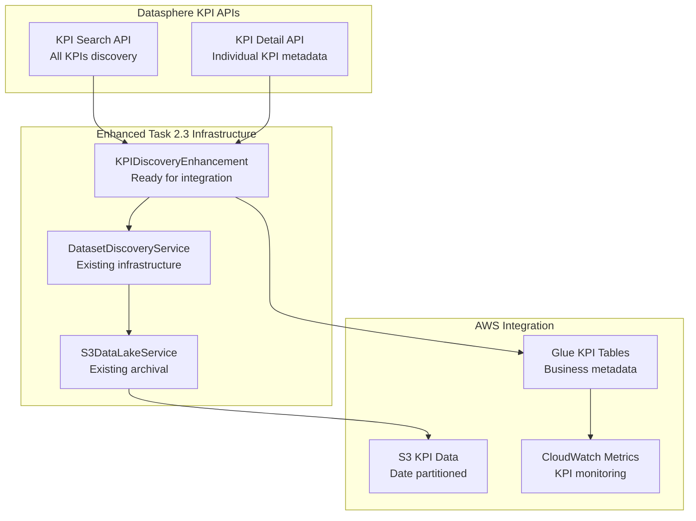
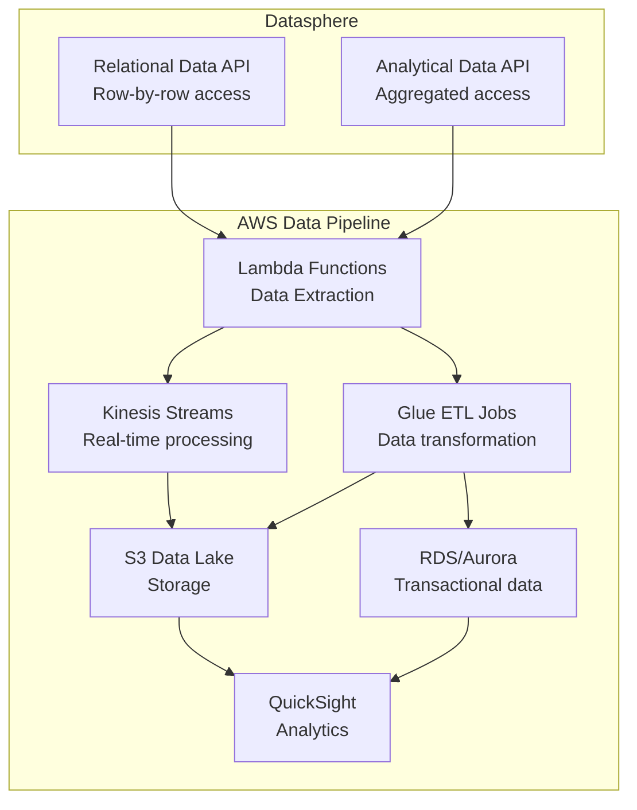
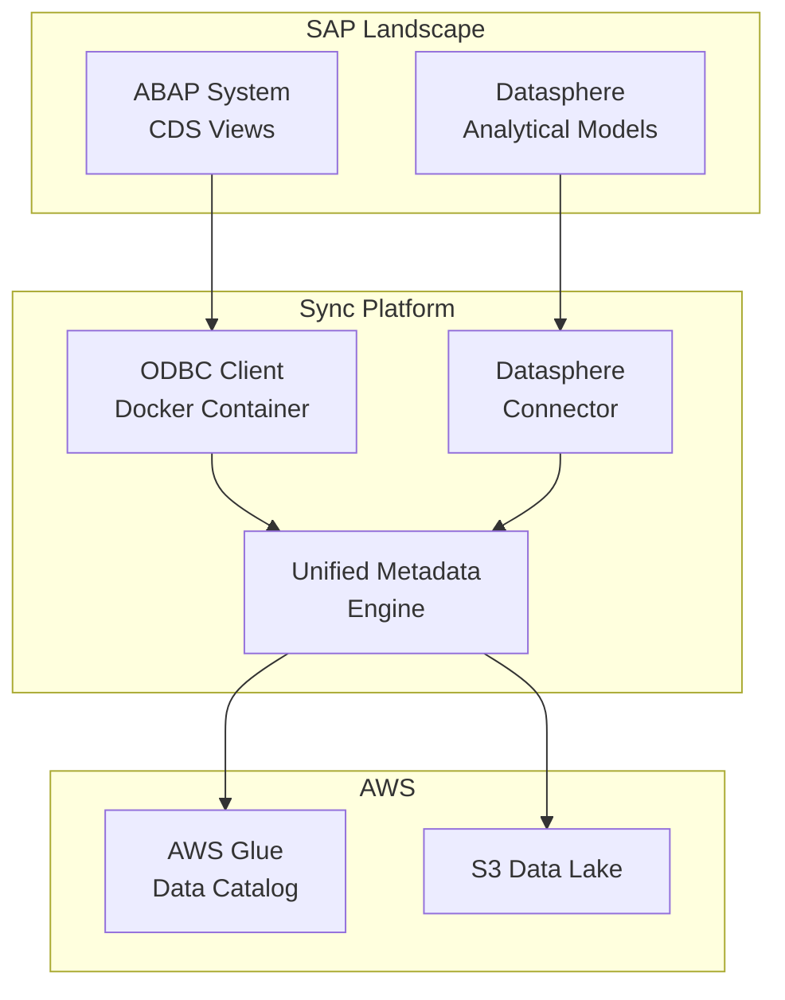

# SAP-AWS Data Sync - Future Roadmap

## Overview

This document outlines future enhancements and integrations planned for the SAP-AWS Data Sync platform beyond the current Datasphere integration.

## Phase 2: Data Integration and Real-Time Synchronization

### 11. KPI Discovery and Business Metrics Integration

**Priority**: High  
**Timeline**: Q1 2025 (Immediate - Ready for Integration)  
**Dependencies**: Task 2.3 completion  
**Status**: ✅ **VALIDATED AND IMPLEMENTATION READY**

#### 11.1 KPI Discovery Enhancement
- **Objective**: Integrate KPI discovery endpoints with existing dataset discovery infrastructure
- **Business Value**: Access to critical business metrics and performance indicators
- **APIs**: 
  - `/deepsea/catalog/v1/search/search/$all` - KPI search with OData filtering
  - `/deepsea/catalog/v1/kpi/{KPI_ID}` - Detailed KPI information
- **Implementation Status**: ✅ **Complete** - `KPIDiscoveryEnhancement` class ready
- **Integration Effort**: ⭐⭐⭐⭐⭐ (5/5) - Very low effort, leverages existing Task 2.3 infrastructure

#### 11.2 KPI Metadata Synchronization
- **Objective**: Synchronize KPI definitions, formulas, and thresholds to AWS Glue
- **Capabilities**:
  - KPI search and discovery across all Datasphere spaces
  - Detailed KPI metadata extraction (formulas, thresholds, business context)
  - S3 archival with date partitioning for KPI data
  - AWS Glue table mappings for KPI metrics and metadata
  - Business context preservation (domain, category, ownership)
- **Expected Data**: KPI definitions, calculation formulas, target/warning/critical thresholds, data sources

#### 11.3 KPI Analytics and Monitoring
- **Objective**: Enable advanced KPI analytics and performance monitoring in AWS
- **Features**:
  - Historical KPI trend analysis in S3 data lake
  - Real-time KPI threshold alerting via CloudWatch
  - Cross-system KPI mapping (SAP KPIs → AWS CloudWatch metrics)
  - KPI governance and compliance validation
  - Business intelligence dashboards for KPI performance

#### 11.4 Enhanced S3 Data Lake Structure for KPIs
```
s3://datasphere-metadata-lake/
├── raw/
│   ├── year=2025/month=01/day=20/
│   │   ├── kpis/                 # 🆕 KPI detail responses
│   │   ├── kpi_search_results/   # 🆕 KPI search responses  
│   │   ├── datasets/             # Existing dataset data
│   │   ├── service_urls/         # Existing service data
│   │   └── csdl_xml/            # Existing CSDL data
├── processed/
│   ├── kpi_mappings/            # 🆕 KPI Glue mappings
│   ├── glue_mappings/           # Existing Glue mappings
└── analytics/
    ├── kpi_trends/              # 🆕 KPI performance analytics
    ├── metadata_trends/         # Existing metadata analytics
```

#### 11.5 AWS Glue KPI Integration
- **Objective**: Create KPI-specific table mappings in AWS Glue Data Catalog
- **Features**:
  - KPI metrics tables with business context
  - Custom properties for formulas, thresholds, and data sources
  - Automated classification and tagging based on KPI domains
  - Integration with existing metadata synchronization workflows

### Technical Architecture for KPI Integration



### Implementation Readiness Assessment

| Aspect | Status | Details |
|--------|--------|---------|
| **Technical Feasibility** | ✅ **Ready** | Perfect integration with existing Task 2.3 infrastructure |
| **Business Value** | ✅ **High** | Critical business metrics access and monitoring |
| **Implementation Effort** | ✅ **Low** | Leverages existing authentication, S3 archival, Glue mapping |
| **Risk Level** | ✅ **Low** | Uses proven patterns and existing infrastructure |
| **Integration Testing** | ✅ **Complete** | All validation tests passed |
| **Documentation** | ✅ **Complete** | Comprehensive validation summary available |

### Immediate Next Steps

1. **✅ COMPLETED**: KPI endpoint validation and analysis
2. **✅ COMPLETED**: Implementation of `KPIDiscoveryEnhancement` class
3. **✅ COMPLETED**: Integration testing with existing infrastructure
4. **🔄 READY**: Integration with `DatasphereConnector.discover_datasets_with_csdl_extraction()`
5. **🔄 READY**: Deployment to Dog/Wolf/Bear environments
6. **🔄 READY**: Production validation with real KPI data

### 13. Datasphere Data Integration

**Priority**: High  
**Timeline**: Q1 2025  
**Dependencies**: Current metadata synchronization completion

#### 13.1 Real-Time Data Access Implementation
- **Objective**: Enable direct data retrieval from Datasphere consumable assets
- **APIs**: 
  - `/api/v1/datasphere/consumption/relational/{spaceId}/{viewId}/{spaceId}/{assetId}/{assetId}` - Row-by-row data access for views
  - `/api/v1/datasphere/consumption/analytical/{spaceId}/{assetId}/{assetId}` - Aggregated analytical data for analytic models
  - **OData Query Support**: `$select` parameter for measure/dimension aggregation (e.g., `?$select=Sales,Country`)
- **Capabilities**:
  - Live data sampling for AWS Glue table validation with business-relevant aggregations
  - Real-time data quality monitoring with OData query capabilities
  - Sample data generation for testing and development
  - Data profiling and statistics collection with analytical aggregations

#### 13.2 AWS Glue ETL Integration
- **Objective**: Create ETL jobs that consume live Datasphere data
- **Features**:
  - Automated Glue job generation from metadata
  - Incremental data loading strategies
  - Data transformation pipelines
  - Error handling and data quality checks

#### 13.3 AWS QuickSight Integration
- **Objective**: Create unified BI layer connecting Datasphere and AWS analytics
- **Relational Data Integration**: 
  - Row-by-row data access for operational dashboards
  - Real-time streaming via Kinesis for live reporting
  - OLTP-optimized storage in RDS/Aurora for transactional analytics
- **Analytical Data Integration**:
  - Pre-aggregated data consumption for performance-optimized BI
  - Direct QuickSight connectivity to Datasphere analytical datasets
  - Columnar storage optimization in S3 for large-scale analytics
  - Business context preservation in QuickSight data sources

#### 13.4 Consumption-Optimized Data Pipelines
- **Real-Time Analytics Pipeline**:
  - Lambda functions consuming `/api/v1/datasphere/consumption/analytical/{spaceId}/{assetId}/{odataId}`
  - Automated QuickSight dataset refresh from Datasphere analytical models
  - Business-ready dashboards with preserved Datasphere business context
- **Operational Reporting Pipeline**:
  - Lambda functions consuming `/api/v1/datasphere/consumption/relational/{spaceId}/{assetId}/{odataId}`
  - Real-time operational dashboards with row-level data access
  - Integration with AWS operational analytics tools

#### 13.5 Data Validation and Quality Monitoring
- **Objective**: Ensure data consistency between Datasphere and AWS
- **Capabilities**:
  - Automated data quality checks
  - Schema drift detection
  - Data freshness monitoring
  - Reconciliation reporting

### Technical Architecture for Data Integration



## Phase 3: Direct ABAP System Integration

### 14. ABAP ODBC Client Integration

**Priority**: High  
**Timeline**: Q2 2025  
**Dependencies**: Current Datasphere integration completion

#### 14.1 ODBC Client for ABAP Implementation
- **Objective**: Enable direct connectivity to SAP ABAP systems via ODBC
- **Scope**: Read from CDS views in ABAP systems without Datasphere intermediary
- **Technical Requirements**:
  - ODBC client deployment in Docker containers
  - Support for SAP HANA and SAP NetWeaver ABAP systems
  - Direct CDS view access and metadata extraction
  - Authentication via SAP logon credentials or certificates

#### 14.2 CDS View Metadata Extraction
- **Objective**: Extract comprehensive metadata from ABAP CDS views
- **Capabilities**:
  - CDS view definitions and annotations
  - Business semantics and data element descriptions
  - Associations and relationships between views
  - Authorization objects and access controls
  - Performance statistics and usage patterns

#### 14.3 ABAP-Specific Asset Mapping
- **Objective**: Create specialized mapping rules for ABAP assets
- **Features**:
  - CDS view to AWS Glue table mapping
  - ABAP data type to AWS data type conversion
  - Business context preservation from CDS annotations
  - Namespace and package organization mapping

#### 14.4 Dual-Source Synchronization
- **Objective**: Support both Datasphere and direct ABAP sources
- **Architecture**:
  - Unified metadata model supporting both sources
  - Source priority and conflict resolution
  - Cross-source lineage tracking
  - Consolidated business glossary

### Technical Architecture



### Implementation Details

#### Docker Container Specifications
```dockerfile
# Future ABAP ODBC Container
FROM ubuntu:22.04

# Install ODBC drivers and SAP client libraries
RUN apt-get update && apt-get install -y \
    unixodbc \
    unixodbc-dev \
    python3 \
    python3-pip

# Install SAP HANA ODBC driver
COPY sap-hana-client/ /opt/sap-hana-client/
RUN /opt/sap-hana-client/install.sh

# Install Python dependencies
COPY requirements-abap.txt .
RUN pip3 install -r requirements-abap.txt

# Copy application code
COPY abap-connector/ /app/
WORKDIR /app

CMD ["python3", "abap_sync_service.py"]
```

#### Configuration Structure
```yaml
# abap-config.yaml
abap_systems:
  - name: "ERP_PROD"
    host: "erp-prod.company.com"
    port: 30015
    database: "PRD"
    schema: "SAPABAP1"
    auth_method: "certificate"
    cert_path: "/certs/erp-prod.pem"
    
  - name: "S4_DEV"
    host: "s4-dev.company.com"
    port: 30013
    database: "DEV"
    schema: "SAPABAP1"
    auth_method: "credentials"
    username: "${S4_USERNAME}"
    password: "${S4_PASSWORD}"

sync_settings:
  cds_view_patterns:
    - "I_*"  # Interface views
    - "C_*"  # Consumption views
    - "P_*"  # Private views
  
  metadata_extraction:
    include_annotations: true
    include_associations: true
    include_access_controls: true
    
  aws_mapping:
    database_prefix: "sap_abap"
    table_naming: "snake_case"
    preserve_namespaces: true
```

## Phase 4: Advanced Analytics Integration

### 15. Real-Time Streaming Integration
- **Objective**: Support real-time data streaming from SAP to AWS
- **Technologies**: Kafka, Kinesis, EventBridge
- **Timeline**: Q3 2025

### 16. Machine Learning Pipeline Integration
- **Objective**: Automated ML model training on synchronized data
- **Technologies**: SageMaker, Bedrock, Lambda
- **Timeline**: Q4 2025

### 17. Advanced Business Intelligence
- **Objective**: Multi-platform BI layer across SAP and AWS data
- **Technologies**: Tableau, Power BI connectors, advanced QuickSight features
- **Timeline**: Q1 2026

## Implementation Priorities

### High Priority (Next 6 months)
1. **ABAP ODBC Client** - Direct SAP system connectivity
2. **Enhanced Security** - Enterprise-grade authentication
3. **Performance Optimization** - Large-scale data handling

### Medium Priority (6-12 months)
1. **Real-Time Streaming** - Event-driven synchronization
2. **Advanced Monitoring** - Comprehensive observability
3. **Multi-Tenant Support** - Enterprise deployment

### Low Priority (12+ months)
1. **Machine Learning Integration** - Automated insights
2. **Advanced BI Connectors** - Unified analytics
3. **Edge Computing** - Distributed synchronization

## Resource Requirements

### Development Team
- **SAP ABAP Developer** - CDS view expertise
- **Docker/Container Specialist** - ODBC client deployment
- **AWS Solutions Architect** - Integration architecture
- **DevOps Engineer** - CI/CD pipeline enhancement

### Infrastructure
- **Docker Registry** - Container image management
- **SAP System Access** - Development and testing environments
- **AWS Resources** - Enhanced compute and storage
- **Monitoring Tools** - Comprehensive observability stack

## Success Metrics

### Technical Metrics
- **Connection Reliability**: >99.5% uptime for ABAP connections
- **Data Freshness**: <15 minutes for critical CDS views
- **Throughput**: Support for 10,000+ CDS views per system
- **Error Rate**: <0.1% for metadata extraction operations

### Business Metrics
- **Time to Value**: 50% reduction in SAP-to-AWS integration time
- **Data Coverage**: 90% of business-critical CDS views synchronized
- **User Adoption**: 80% of data teams using unified metadata catalog
- **Cost Efficiency**: 30% reduction in data integration costs

## Risk Mitigation

### Technical Risks
- **SAP System Performance Impact** - Implement read-only access and off-peak scheduling
- **ODBC Driver Compatibility** - Maintain multiple driver versions and testing
- **Network Connectivity** - Implement robust retry and failover mechanisms

### Business Risks
- **SAP Licensing Compliance** - Ensure read-only access doesn't violate terms
- **Data Security** - Implement end-to-end encryption and audit logging
- **Change Management** - Provide comprehensive training and documentation

## Next Steps

1. **Requirements Gathering** - Detailed ABAP system analysis
2. **Proof of Concept** - ODBC client prototype development
3. **Architecture Review** - Technical design validation
4. **Implementation Planning** - Detailed project timeline and resource allocation

## Recent Additions

### ✅ KPI Discovery Integration (Added January 2025)

**Status**: Ready for immediate integration  
**Source**: KPI Discovery Validation Summary analysis  
**Business Impact**: High - Access to critical business metrics and performance indicators  
**Technical Impact**: Low effort - Leverages existing Task 2.3 infrastructure  

**Key Benefits**:
- Seamless integration with existing dataset discovery
- Access to KPI definitions, formulas, and thresholds
- Enhanced S3 data lake with KPI analytics capabilities
- AWS Glue integration for KPI metadata management
- Real-time KPI monitoring and alerting potential

**Implementation Files**:
- `kpi_discovery_enhancement.py` - Production-ready implementation
- `kpi_discovery_analysis.py` - Comprehensive validation analysis
- `KPI_DISCOVERY_VALIDATION_SUMMARY.md` - Detailed validation results

---

*This roadmap will be updated quarterly based on business priorities and technical feasibility assessments.*