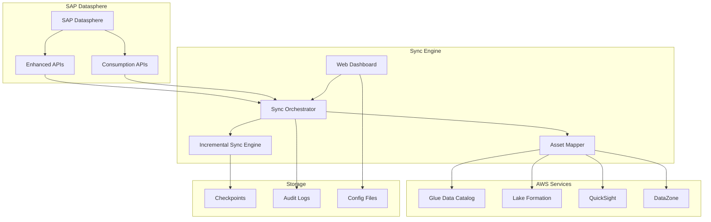
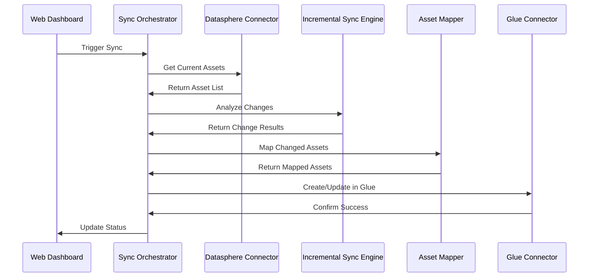
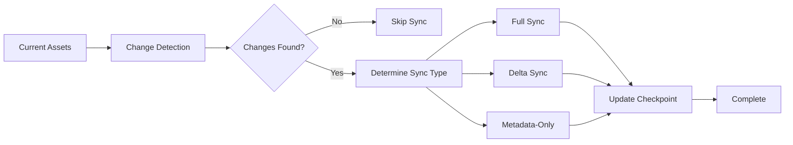

# Architecture Overview

The SAP Datasphere to AWS metadata synchronization system is built on a modern, scalable architecture that prioritizes performance, reliability, and maintainability. This document provides a comprehensive overview of the system's architecture, components, and design principles.

## 🏗️ High-Level Architecture



## 🎯 Core Design Principles

### 1. **Incremental-First Architecture**
- **Change Detection**: Hash-based comparison for precise change identification
- **Delta Synchronization**: Only sync what has changed (90% bandwidth savings)
- **Checkpoint Management**: Persistent state for reliable resume capabilities

### 2. **Priority-Based Processing**
- **Critical Priority**: Real-time sync for analytical models
- **High Priority**: Hourly sync for views and core tables
- **Medium Priority**: Daily sync for data flows and regular tables
- **Intelligent Scheduling**: Business context-aware prioritization

### 3. **Three-Environment Strategy**
- **🐕 DOG (Development)**: Docker-based development with mock data
- **🐺 WOLF (Testing)**: FastAPI with real Datasphere integration
- **🐻 BEAR (Production)**: AWS Lambda serverless deployment

### 4. **Microservices Architecture**
- **Loosely Coupled**: Independent components with clear interfaces
- **Scalable**: Horizontal scaling through worker pools
- **Resilient**: Comprehensive error handling and retry mechanisms

## 🔧 Core Components

### 1. Sync Orchestrator
**Purpose**: Central coordination and job management

**Key Features**:
- Priority-based job queue with automatic ordering
- Configurable worker pools (default: 5 concurrent jobs)
- Comprehensive job lifecycle management
- Real-time metrics and monitoring

**Technologies**:
- Python ThreadPoolExecutor for concurrent processing
- PriorityQueue for intelligent job ordering
- Comprehensive logging and audit trails

```python
# Example: Priority-based job scheduling
orchestrator = SyncOrchestrator(max_workers=5, enable_incremental_sync=True)
job_id = orchestrator.schedule_asset_sync(
    asset=analytical_model,
    target_system=SourceSystem.GLUE,
    priority=SyncPriority.CRITICAL
)
```

### 2. Incremental Sync Engine
**Purpose**: Intelligent change detection and delta synchronization

**Key Features**:
- **Hash-Based Change Detection**: Content, schema, and metadata comparison
- **Multiple Sync Strategies**: Full, delta, metadata-only, deletion handling
- **Checkpoint Management**: Persistent storage with automatic cleanup
- **Performance Optimization**: Up to 90% bandwidth reduction

**Change Detection Algorithm**:
```python
# Three-tier hash system
content_hash = hash(technical_name, business_name, description, owner)
schema_hash = hash(schema_info, columns, data_types)
metadata_hash = hash(business_context, tags, dimensions, measures)
```

### 3. Asset Mapper
**Purpose**: Transform Datasphere assets for AWS compatibility

**Key Features**:
- **Configurable Mapping Rules**: Asset-specific transformation logic
- **Business Context Preservation**: Maintain semantic meaning
- **Conflict Resolution**: Intelligent handling of naming conflicts
- **Validation Framework**: Ensure mapping accuracy

**Mapping Strategies**:
| Datasphere Asset | AWS Glue Equivalent | Strategy |
|------------------|---------------------|----------|
| Space | Database | 1:1 with naming convention |
| Analytical Model | Table + Metadata | Business-ready consumption |
| Table | Table | Direct schema mapping |
| View | External Table | View definition preservation |

### 4. Connectors

#### Datasphere Connector
**Purpose**: Interface with SAP Datasphere APIs

**Features**:
- **OAuth 2.0 Authentication**: Secure token management
- **Enhanced API Access**: Rich metadata extraction
- **Rate Limiting**: Intelligent request throttling
- **Error Handling**: Comprehensive retry logic

**API Endpoints**:
- Standard Consumption APIs: Basic object enumeration
- Enhanced Deepsea APIs: Rich CSN definitions with business context
- Browser Authentication: Required for enhanced features

#### AWS Glue Connector
**Purpose**: Interface with AWS Glue Data Catalog

**Features**:
- **IAM Authentication**: Role-based access control
- **Batch Operations**: Efficient bulk updates
- **Schema Validation**: Ensure data type compatibility
- **Tagging Support**: Business context preservation

### 5. Web Dashboard
**Purpose**: User interface for monitoring and management

**Features**:
- **Real-time Monitoring**: Live sync status and metrics
- **Configuration Management**: Visual configuration editor
- **Connection Testing**: Validate Datasphere and AWS connections
- **Performance Analytics**: Bandwidth savings and efficiency metrics

**Technology Stack**:
- **Backend**: FastAPI with async support
- **Frontend**: Bootstrap 5 with responsive design
- **Real-time Updates**: WebSocket integration
- **Authentication**: OAuth integration

## 📊 Data Flow Architecture

### 1. Metadata Discovery Flow



### 2. Incremental Sync Flow



## 🔄 Synchronization Strategies

### 1. Full Synchronization
**When**: New assets, schema changes, initial sync
**Data Transfer**: 100% of asset data
**Use Cases**: 
- New analytical models
- Schema modifications
- First-time synchronization

### 2. Delta Synchronization
**When**: Content modifications, partial updates
**Data Transfer**: ~30% of asset data (70% savings)
**Use Cases**:
- Description updates
- Business context changes
- Minor schema additions

### 3. Metadata-Only Synchronization
**When**: Business context updates only
**Data Transfer**: ~1KB per asset (90% savings)
**Use Cases**:
- Tag updates
- Steward information changes
- Certification status updates

### 4. Deletion Handling
**When**: Assets removed from source
**Data Transfer**: 0 bytes
**Use Cases**:
- Asset retirement
- Space reorganization
- Cleanup operations

## 🏢 Three-Environment Architecture

### 🐕 DOG Environment (Development)
**Purpose**: Safe development and prototyping

**Characteristics**:
- **Technology**: Docker containerized Flask application
- **Port**: 8000
- **Data**: Mock Datasphere and Glue data
- **Features**: Hot-reload, interactive debugging, API explorer

**Use Cases**:
- Feature development
- Unit testing
- API experimentation
- Safe prototyping

### 🐺 WOLF Environment (Testing)
**Purpose**: Integration testing with real systems

**Characteristics**:
- **Technology**: FastAPI with real integrations
- **Port**: 5000
- **Data**: Real Datasphere connection, test AWS account
- **Features**: OAuth authentication, performance benchmarking

**Use Cases**:
- Integration testing
- Performance validation
- End-to-end testing
- Pre-production validation

### 🐻 BEAR Environment (Production)
**Purpose**: Enterprise-grade production deployment

**Characteristics**:
- **Technology**: AWS Lambda serverless
- **Location**: AWS Cloud (us-east-1)
- **Features**: Auto-scaling, high availability, monitoring
- **Access**: Public API endpoint with authentication

**Use Cases**:
- Production metadata synchronization
- Enterprise integration
- Scalable operations
- 24/7 availability

## 📈 Performance Architecture

### Scalability Features
- **Horizontal Scaling**: Multiple worker processes
- **Async Processing**: Non-blocking I/O operations
- **Connection Pooling**: Efficient resource utilization
- **Caching**: In-memory caching for frequently accessed data

### Performance Optimizations
- **Batch Processing**: Group operations for efficiency
- **Parallel Execution**: Concurrent sync operations
- **Intelligent Caching**: Cache metadata and authentication tokens
- **Compression**: Reduce network traffic

### Monitoring & Metrics
- **Real-time Metrics**: Job completion rates, error rates
- **Performance Analytics**: Bandwidth savings, execution times
- **Health Monitoring**: System health and resource utilization
- **Alerting**: Automated alerts for critical issues

## 🔒 Security Architecture

### Authentication & Authorization
- **OAuth 2.0**: Secure Datasphere authentication
- **IAM Roles**: AWS resource access control
- **Token Management**: Automatic token refresh
- **Audit Logging**: Complete operation audit trails

### Data Protection
- **Encryption in Transit**: TLS 1.2+ for all communications
- **Encryption at Rest**: Encrypted checkpoint storage
- **PII Handling**: Automatic PII detection and masking
- **Access Control**: Role-based access to sensitive operations

### Compliance Features
- **Audit Trails**: Complete synchronization history
- **Data Lineage**: End-to-end traceability
- **Retention Policies**: Configurable data retention
- **Compliance Reporting**: Automated compliance reports

## 🔮 Future Architecture Enhancements

### Planned Improvements
- **MCP Server Integration**: AI-accessible metadata operations
- **Machine Learning**: Predictive sync optimization
- **Multi-Region Support**: Global deployment capabilities
- **Advanced Analytics**: Enhanced performance insights

### Scalability Roadmap
- **Kubernetes Deployment**: Container orchestration
- **Event-Driven Architecture**: Real-time change notifications
- **Microservices Decomposition**: Further service separation
- **Global Load Balancing**: Worldwide availability

---

## 📚 Related Documentation

- **[Incremental Synchronization](./incremental-sync)** - Deep dive into change detection


This architecture provides a solid foundation for enterprise-grade metadata synchronization while maintaining flexibility for future enhancements and scaling requirements.